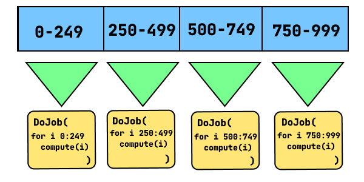

# Threads Assignment

For this assignment you will create a multi-threaded Job System utilizing the C++ standard library.

This is a system that grabs multiple small **independent jobs** and executes them in different threads.

You can run from 1 to n amount of threads, n being dependent in the number of CPU cores that machine has. C++11 helps you to get that number by advising the number of concurrent threads in its function [`std::thread::hardware_concurrency()`](https://en.cppreference.com/w/cpp/thread/thread/hardware_concurrency). If the value is not defined or not computable, it will return 0.

### CMake to build the project

We are using [CMake](https://cmake.org) to define the project and build it for either Windows or Ubuntu. 


To build the project on the command line **`cd`** into the root of the project and invoke the following commands:
```sh
# create a folder called build and generate build files from this source directory
# Tell cmake to generate Release version of the project. This is needed when making makefiles
cmake -DCMAKE_BUILD_TYPE=Release -B build -S .
# create the assignment exe using the build files
# --config Release isn't needed if we have makefiles but if we have XCode/Visual Studio then 
#   we need this flag to get a Release exe
cmake --build build --config Release
```

Note the executable will be in the **\build\dist\CONFIG** folder, where CONFIG could be Debug, Release, etc...

## Setting Up the Job System

On initialization, the system needs to open `N-1` threads where `N` is the number of CPU cores. This will be the pool of worker threads. Note the `-1` here. We want the _main thread_ to also fully utilize a CPU core too.

Each worker thread will contain an infinite loop, where it is consistently looking for an arbitrary _Job_ to do. We will represent the _Job_ as a `std::function<void(void)>`.

```c++
class JobSystem
{
public:
    using Job = std::function<void(void)>;
   
    void DoJob(Job job);
    void WaitUntilDone();

    // more later ...

public:
    JobSystem();
    ~JobSystem(); // RAII
public:
    // Rule of 5
    JobSystem(const JobSystem&) = delete;
    JobSystem(JobSystem&&)      = delete;
    JobSystem& operator=(const JobSystem&) = delete;
    JobSystem& operator=(JobSystem&&) = delete;

private:
    // helper function(s)
private:
    // fields
};
```

Here is some pseudo code showing how to setup the system:

```txt
JobSystem Constructor
    num_hw_threads <- get number of CPU cores
    num_workers <- num_hw_threads - 1

    for 0 to num_workers-1
        create thread with worker function

Worker Function
    while not isDone
        current job <- try get job
        if has job
            invoke job
            --numberOfJobs
        else
            use unique_lock to sleep and
            wait to be woken up
```

## Shutting Down the Job System

When the system shuts down, each worker thread needs to be signaled to end their loops and then we will wait for them to end.

```txt
Job System Destructor
    isDone <- true
    notify all threads to wake up
    for each thread worker
        join thread if joinable
```

## Adding A Job

Now that we have a pool of threads, we need a way to _enqueue_ jobs.

```txt
DoJob job
    ++numberOfJobs
    push given job to queue of jobs
    notify one thread to wake up to process this new job
```

## Wait for all jobs to finish

After the main thread enqueues all of the jobs, it will most likely do some of it's own work. At some point it will need the result of the jobs work and it will use the `WaitUntilDone()` function to block and wait for all jobs in the job queue to be completed.

Since the `WaitUntilDone()` function will block the main thread, the Job System will put the main thread to work so that no CPU cores are left idle.

Here's what the code could look like:

```txt
WaitUntilDone
    while numberOfJobs > 0
        current job <- try get job
        if has job
            invoke job
            --numberOfJobs
```

## Adding Big Data Jobs

Sometimes we have a big data set, and wish to distribute the processing of that data across many threads.

Often times, the data processing is quite simple and straightforward and it would not make sense to execute each element on separate threads. The cost of the thread and synchronizing the thread would outweigh the benefits.

Instead of processing one element per thread, we want to process separate **ranges of elements** across the threads. This will reduce the overhead of the threads and take advantage of CPU cache coherency.

Imagine we have 1,000 elements to do some computation on. We want to split up the range into chunks, where each chunk will be done by 1 thread. 



If we have 4 CPU cores then we can enqueue 4 jobs where each job loops over and computes their own chunk.

Here is what the interface will look like.

```c++
using ComputeAtIndex = std::function<void(int)>;
void DoJobs(int how_many, ComputeAtIndex compute);
```

Example usage:
```c++
vector<double> values(300'000);
// Each element will have a value of it's index
job_system.DoJobs(300'000, [&](int index){
    values[index] = 1.0 * index;
});
// if there are 4 cpu cores then this will create 4 jobs 
//   where each job will inoke the above lambda for
//   75,000 elements.
```

pseudo-code of one way we could implement this:
```txt
DoJobs how_many, compute
    elments_per_group <- how_many / num_threads
    remainder <- how_many modulus num_threads;
    start_index <- 0
    for 0 to num_threads-1
        task_total <- elements_per_group
        if remainder is not 0
            task_total <- task_total + remainder
            remainder <- 0
        end_index <- start_index + task_total
        DoJob(
            for i start_index to end_index
                compute(i)
            )
        start_index <- end_index
```

## Synchronization

### Utilize mutexes

Use mutexes to protect any fields that could change value across threads.

Definitely, your queue of jobs will require a mutex to make sure only one thread can use it at a time.

### Utilize atomic variables

For simple integer like types, use atomic variables rather than mutexes for synchronizing.

You could use these for fields like `isDone` and `numberOfJobs` fields.

This should simplify the code, be slightly more efficient and still keep their state synchronized across all threads.

### Utilize condition variables

If there is no work to be done because our job queue is empty then we want our worker threads to sleep. However it doesn't make sense to sleep for a fixed amount of time since we could sleep for too long or too short, which would waste time.

We want to only sleep while there is nothing to do and wake just when there is work to be done.

This exactly what [`std::condition_variable`](https://en.cppreference.com/w/cpp/thread/condition_variable) is for.

`std::condition_variable` is a synchronization primitive that allows threads to wait for a notification from another thread. Here's how you can use it to put multiple threads to sleep using `wait(lock)`, wake them up one at a time using `notify_one()`, and wake them up all at once using `notify_all()`:

1. Create a `std::mutex` object and a `std::condition_variable` object.
2. Lock the mutex using `std::unique_lock<std::mutex> lock(mutex)`.
3. Call `wait(lock)` on the condition variable object to put the thread to sleep. This will release the lock on the mutex and wait for a notification from another thread.
4. To wake up one thread, call `notify_one()` on the condition variable object. This will wake up one thread that is waiting on the condition variable.
5. To wake up all threads, call `notify_all()` on the condition variable object. This will wake up all threads that are waiting on the condition variable.

Here's an example code snippet that demonstrates the use of `std::condition_variable`:

```c++
#include <atomic>
#include <condition_variable>
#include <iostream>
#include <mutex>
#include <sstream>
#include <thread>

std::mutex              gWakeUpMutex;
std::condition_variable gWakeUpEvent;
std::atomic_bool        gReady;

void worker(int id)
{
    std::unique_lock<std::mutex> lock(gWakeUpMutex);
    while (!gReady)
    {
        std::ostringstream oss;
        oss << "Thread " << id << " sleeping...\n";
        std::cout << oss.str();
        gWakeUpEvent.wait(lock);
    }
    std::ostringstream oss;
    oss << "Worker " << id << " is working" << std::endl;
    std::cout << oss.str();
}

int main()
{
    gReady = false;
    std::thread workers[6];
    int         id = 0;
    for (auto& t : workers)
    {
        t = std::thread(worker, id++);
    }
    std::this_thread::sleep_for(std::chrono::seconds(1));
    gWakeUpEvent.notify_one();
    std::this_thread::sleep_for(std::chrono::seconds(1));
    gWakeUpEvent.notify_one();
    std::this_thread::sleep_for(std::chrono::seconds(2));
    gReady = true;
    gWakeUpEvent.notify_all();
    for (auto& t : workers)
    {
        t.join();
    }
    return 0;
}
```
The `worker` function is executed by each thread. It acquires a lock on the `gWakeUpMutex` using `std::unique_lock<std::mutex> lock(gWakeUpMutex)` and then waits for a notification from the main thread using `gWakeUpEvent.wait(lock)`. While waiting, it prints a message to the console indicating that it is sleeping.

In the `main` function, 6 worker threads are created using `std::thread(worker, id++)`. The main thread then waits for 1 second and notifies one of the worker threads using `gWakeUpEvent.notify_one()`. After another second, it notifies another worker thread. From this we should see two out of the six threads repeat their sleeping message.

 Finally, after 2 more seconds, it sets the `gReady` flag to true and notifies all the worker threads using `gWakeUpEvent.notify_all()`. We should see all 6 threads print out that they are working and then finish.

The use of `std::unique_lock` with `std::condition_variable` **is important**. It provides more flexibility and safety than `std::lock_guard`. `std::unique_lock` is a general-purpose lock that can be locked and unlocked multiple times, whereas `std::lock_guard` is a one-time lock that is automatically released when it goes out of scope. 

When using `std::condition_variable`, the lock must be released before waiting and reacquired after waking up. This is because `std::condition_variable::wait()` requires a lock to be passed as an argument, and it will release the lock before waiting and reacquire it after waking up. If you use `std::lock_guard`, the lock will be automatically released when the `std::lock_guard` goes out of scope, which is before the call to `std::condition_variable::wait()`. This would cause a deadlock because the lock would not be released before waiting.

On the other hand, `std::unique_lock` can be locked and unlocked multiple times, which makes it more flexible. You can lock the mutex before calling `std::condition_variable::wait()`, and then unlock it while waiting. This allows other threads to acquire the lock and modify the shared data. When the condition is met, the thread can reacquire the lock and continue execution.


## Create a ReadMe

Create a **`ReadMe.md`** markdown file that defines the following.

1. Your name, assignment name/number, course name, term
2. Section describing anything incomplete about the assignment
3. Section describing something you're proud of about the assignment

# Submission

Submit your `JobSystem.cpp` and `JobSystem.h` on the course site. 


## Grading Rubric
- [ ] [**core**] Ctor/Dtor creates & destroys a pool of worker threads where the amount is based off of the amount of CPU cores. The worker threads loop infinitely until signaled to stop.
- [ ] [**core**] Implemented the `DoJob()` member function so that users can queue any amount of jobs to be run across worker threads
- [ ] [**core**] Implemented the `DoJobs()` member function so that users can do many small computations across the threads in the thread pool.
- [ ] [**core**] All member fields that are changed across threads are synchronized
- [ ] Simplified the JobSystem code by creating and using atomic variables where applicable
- [ ] Code builds and runs on Windows and Ubuntu
- [ ] Create a properly filled out `ReadMe.md` file.
- [ ] All source files have a proper header comment with your name, assignment name/number, course name, term.
- [ ] All source files compile without warnings and without errors on both platforms
- [ ] Followed the appropriate Code Quality Guidelines and Code Style Guidelines.

Scores for Assignments will be given as the following:

Score        | Assessment
------------ | ----------
F            | Nothing turned in at all
D            | Close to meeting core requirements
C            | Meets all of the core requirements
B            | Close to meeting all requirements
A            | Clearly meets all requirements 
S            | High quality, well beyond the requirements

### Ideas to get an Excellent score

Add more features for users or make the job system more efficient.

Checkout the following to get some ideas:

[Building a load-balanced task scheduler](https://blog.molecular-matters.com/2012/04/05/building-a-load-balanced-task-scheduler-part-1-basics/)

[Job System 2.0: Lock-Free Work Stealing](https://blog.molecular-matters.com/2015/08/24/job-system-2-0-lock-free-work-stealing-part-1-basics/)

